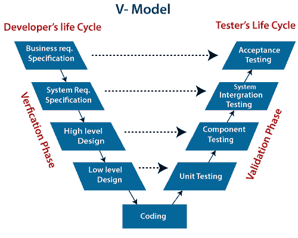

# v 型

> 原文：<https://www.javatpoint.com/software-engineering-v-model>

虚拟模型也称为验证和确认模型。在这种情况下，SDLC 的每个阶段都必须在下一阶段开始之前完成。它遵循与瀑布模型相同的顺序设计过程。该设备的测试计划与相应的开发阶段并行进行。

**验证:**涉及不执行代码完成的静态分析方法(评审)。它是对产品开发过程进行评估的过程，以发现规定的要求是否满足。

**验证:**涉及动态分析方法(功能性、非功能性)，通过执行代码完成测试。验证是在开发过程完成后对软件进行分类的过程，以确定软件是否满足客户的期望和要求。

所以 V-Model 的一边包含验证阶段，另一边包含验证阶段。验证和确认过程由 V 形编码阶段连接。因此，它被称为 V 型。

**V 型验证阶段有各个阶段:**

1.  **业务需求分析:**这是从客户方了解产品需求的第一步。此阶段包含详细的沟通，以了解客户的期望和确切要求。
2.  **系统设计:**在此阶段系统工程师通过研究用户需求文档，分析和解读拟建系统的业务。
3.  **架构设计:**选择架构的基准是，它应该了解所有通常由模块列表、每个模块的简要功能、它们的接口关系、依赖关系、数据库表、架构图、技术细节等组成的内容。集成测试模型在特定阶段执行。
4.  **模块设计:**在模块设计阶段，系统分解成小模块。模块的详细设计被指定，这被称为低级设计
5.  **编码阶段:**设计完成后，开始编码阶段。根据需求，确定合适的编程语言。编码有一些准则和标准。在签入存储库之前，最终的构建会针对更好的性能进行优化，并且代码会经过多次代码审查来检查性能。

**V 型的验证阶段有各个阶段:**

1.  **单元测试:**在 V 型模型中，单元测试计划(UTPs)是在模块设计阶段制定的。执行这些 UTP 是为了消除代码级或单元级的错误。单元是可以独立存在的最小实体，例如程序模块。单元测试验证最小的实体在与其余代码/单元隔离时能够正常运行。
2.  **集成测试:**集成测试计划在架构设计阶段制定。这些测试验证了独立创建和测试的组之间可以共存和交流。
3.  **系统测试:**系统测试计划在系统设计阶段制定。与单元和集成测试计划不同，系统测试计划是由客户编写的？美国商业团队。系统测试确保满足应用程序开发人员的期望。
4.  **验收测试:**验收测试与业务需求分析部分相关。它包括在用户环境中测试软件产品。验收测试揭示了不同系统的兼容性问题，这在用户环境中是可用的。它联合发现非功能性问题，如真实用户环境中的负载和性能缺陷。

## 什么时候用 V 型？

*   当需求被很好的定义并且不含糊的时候。
*   V 型模型应该用于需求明确且固定的中小型项目。
*   当样本技术资源具备必要的技术专长时，应选择 V 型模型。

## V 型车的优势(优点):

1.  容易理解。
2.  像计划、测试设计这样的测试方法在编码之前就已经出现了。
3.  这样可以节省很多时间。因此比瀑布模型更有可能成功。
4.  避免缺陷向下流动。
5.  适用于需求易于理解的小计划。

## V 型车的缺点:

1.  非常僵硬，最不灵活。
2.  对复杂的项目来说不是个好主意。
3.  软件是在实现阶段开发的，因此没有产生软件的早期原型。
4.  如果中途发生任何变化，那么测试文档以及所需的文档都必须更新。

* * *