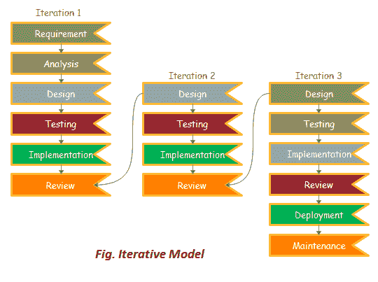

# 迭代模型

> 原文：<https://www.javatpoint.com/software-engineering-iterative-model>

在这个模型中，您可以从一些软件规范开始，开发软件的第一个版本。在第一个版本之后，如果需要改变软件，则用新的迭代创建软件的新版本。迭代模型的每一次发布都在一个精确且固定的周期内完成，这个周期称为迭代。

迭代模型允许访问较早的阶段，在这些阶段中分别进行变化。项目的最终输出在软件开发生命周期(SDLC)过程结束时更新。

### 迭代模型的各个阶段如下:

**1。需求收集&分析:**在这个阶段，从客户那里收集需求，由分析师检查需求是否满足。分析师检查需求是否会在预算内实现。在所有这些之后，软件团队跳到下一个阶段。

**2。设计:**在设计阶段，团队通过数据流图、活动图、类图、状态转移图等不同的图来设计软件。

**3。实现:**在实现中，需求用编码语言编写，并转换成称为软件的计算机程序。

**4。测试:**完成编码阶段后，软件测试开始使用不同的测试方法。测试方法有很多，但最常见的是白盒、黑盒和灰盒测试方法。

**5。部署:**完成所有阶段后，软件被部署到其工作环境中。

**6。评审:**在这个阶段，在产品部署之后，执行评审阶段以检查开发产品的行为和有效性。如果发现任何错误，那么流程将从需求收集开始。

**7。维护:**在维护阶段，软件部署到工作环境后，可能会出现一些 bug、一些错误或者需要新的更新。维护包括调试和新的添加选项。

## 何时使用迭代模型？

1.  当需求定义清晰易懂时。
2.  当软件应用程序很大时。
3.  当未来有变化的要求时。

## 迭代模型的优势(优点):

1.  较小迭代期间的测试和调试很容易。
2.  并行开发可以计划。
3.  它很容易被项目不断变化的需求所接受。
4.  风险在迭代过程中被识别和解决。
5.  有限的时间花在文档上，额外的时间花在设计上。

## 迭代模型的缺点:

1.  它不适合较小的项目。
2.  可能需要更多资源。
3.  因为需求不完善，设计可以一次又一次地改变。
4.  需求变化会导致预算超支。
5.  由于需求变化，项目完成日期未得到确认。

* * *