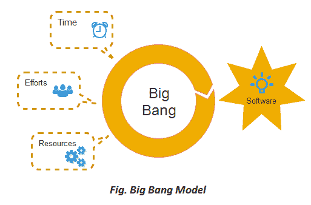

# 大爆炸模型

> 原文：<https://www.javatpoint.com/software-engineering-big-bang-model>

在这个模型中，开发人员不遵循任何特定的过程。发展始于投入形式的必要资金和努力。结果可能符合也可能不符合客户的要求，因为在这个模型中，甚至连客户的要求都没有定义。

这种模式非常适合学术项目或实践项目等小型项目。一两个开发人员可以在这个模型上一起工作。

## 什么时候用大爆炸模型？

正如我们上面讨论的，当这个项目像学术项目或实践项目一样小的时候，这个模型是必需的。当开发团队规模较小，需求没有定义，发布日期没有得到客户确认或给出时，也使用这种方法。

## 大爆炸模型的优势(优点):

1.  不需要计划。
2.  简单模型。
3.  所需资源很少。
4.  易于管理。
5.  对开发者来说很灵活。

## 大爆炸模型的缺点:

1.  存在高风险和不确定性。
2.  对于大型项目不可接受。
3.  如果要求不明确，会导致非常昂贵。

* * *