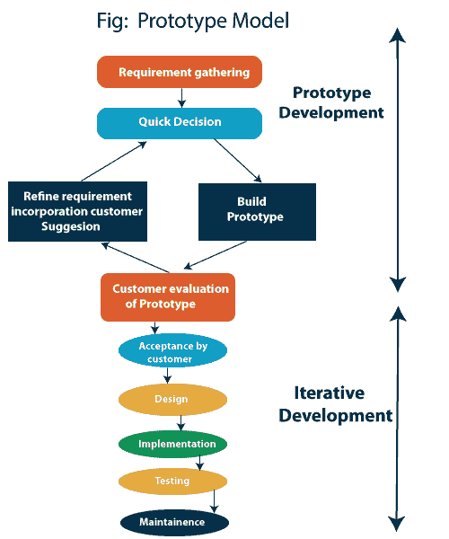

# 原型模型

> 原文：<https://www.javatpoint.com/software-engineering-prototype-model>

原型模型要求在进行实际软件开发之前，应该建立系统的工作原型。原型是系统的玩具实现。原型通常是实际系统的非常粗糙的版本，与实际软件相比，可能表现出有限的功能能力、低可靠性和低效的性能。在许多情况下，客户对软件产品的期望只有一个大概的了解。在缺乏关于系统输入、处理需求和输出需求的详细信息的情况下，可以采用原型模型。

## 原型模型的步骤

1.  需求收集和分析师
2.  快速决定
3.  构建原型
4.  评估或用户评估
5.  原型细化
6.  工程产品

## 原型模型的优势

1.  降低用户需求不正确的风险
2.  在需求变化/未提交的情况下很好
3.  常规可见过程辅助管理
4.  支持早期产品营销
5.  降低维护成本。
6.  由于系统是并行制造的，因此可以更早地检测到错误。

## 原型模型的缺点

1.  一个不稳定/执行不良的原型往往会成为最终产品。
2.  需要广泛的客户合作
    *   花费客户的钱
    *   需要忠诚的客户
    *   如果客户退出，很难完成
    *   可能过于针对客户，没有广阔的市场
3.  很难知道这个项目会持续多久。
4.  如果没有适当的需求分析、设计、客户评估和反馈，很容易退回到代码中并修复。
5.  原型工具很贵。
6.  构建原型需要特殊的工具和技术。
7.  这是一个耗时的过程。

## 进化过程模型

进化过程模型类似于迭代增强模型。瀑布模型的相同阶段是以循环的方式出现的。该模型与迭代增强模型的不同之处在于，它不需要在每个周期结束时都有有用的产品。在进化开发中，需求是通过类别而不是优先级来实现的。

例如，在一个简单的数据库应用程序中，一个周期可能实现图形用户界面，另一个文件操作，另一个查询和另一个更新。在有可用的工作产品之前，所有四个循环都必须完成。图形用户界面允许用户与系统交互，文件操作允许保存和检索数据，查询允许用户离开系统，更新允许用户将数据放入系统。

## 进化过程模型的好处

EVO 的使用大大降低了软件项目的风险。

EVO 可以通过提供一个结构化的、有纪律的实验途径来降低成本。

EVO 允许营销部门获得早期交付，促进文件和演示的发展。

使产品更好地适应用户需求和市场需求。

通过定义早期周期内容来管理项目风险。

尽早发现关键问题，适当集中注意力。

增加冲击市场窗口的机会。

通过尽早接触客户，加快销售周期。

提高项目进度的管理可见性。

提高产品团队的生产力和积极性。

* * *