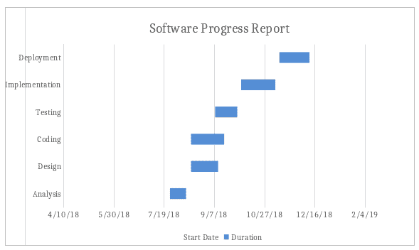
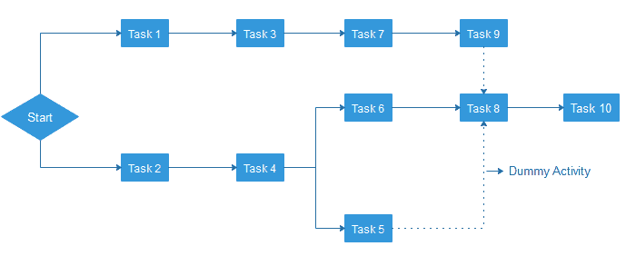
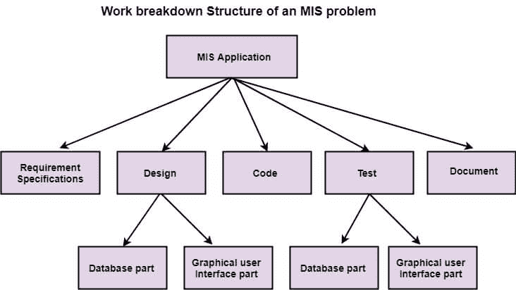

# 项目管理工具

> 原文：<https://www.javatpoint.com/software-project-management-tools>

为了充分有效地管理项目管理系统，我们使用项目管理工具。

**这里有一些标准工具:**

## 甘特图表

甘特图由亨利·甘特于 1917 年首次开发。甘特图通常在项目管理中使用，它是显示活动时间的最流行和最有用的方式之一。每个活动由一个条表示。

当您想要查看一个或多个项目的整体情况时，甘特图是一个有用的工具。它可以帮助您查看哪些任务相互依赖，哪些事件即将发生。

## 计划评审技术图

计划评审技术是计划评审技术的缩写。在 20 世纪 50 年代，它由美国海军开发，用于处理北极星潜艇导弹计划。

在项目管理中，以网络图形式表示的代表事件的节点数的计划评审技术图。

线条的方向表示任务的顺序。在上面的示例中，“任务 1 到任务 9”之间的任务必须完成，这些任务被称为从属任务或串行任务。在任务 4 和任务 5 以及任务 4 和任务 6 之间，节点是不依赖的，可以同时进行。这些被称为并行或并发任务。没有资源或完成时间，任务必须按照被认为是事件相关性的顺序完成，这些被称为虚拟活动，用虚线表示。

## 逻辑网络

逻辑网络显示活动随时间的顺序。它显示了活动的顺序。区分事件和确定项目是两个主要用途。此外，它将有助于理解任务相关性、时间表和整个项目工作流。

## 产品细分结构

产品分解结构是一种管理工具，也是项目设计中必不可少的一部分。这是一个面向任务的系统，用于将项目细分为产品部分。产品分解结构描述子任务或工作包，并表示工作包之间的联系。在产品细分结构中，项目工作用各种类型的列表进行了图解。产品细分结构就像工作细分结构(WBS)。

## 工作分解结构

这是一个重要的项目交付成果，它将团队的工作划分为灵活的部分。“项目管理知识体系(PMBOK)”是一组术语，将工作分解结构描述为“由项目团队执行的面向交付的工作层次分解。”

有两种方法可以生成工作分解结构？自上而下和

自下而上的方法。

在**自上而下的方法**中，WBS 是通过将整个项目分解为子项目或较低级别的任务而得到的。

**自下而上的方法**更类似于头脑风暴练习，要求团队成员列出完成项目所需的低级任务。

## 资源直方图

资源直方图精确地说是一个条形图，用于显示资源在预先安排的特定时间段内的工作时间。资源直方图还可以包含资源可用性的相关特征，用于进行对比。

## 关键途径分析法

关键路径分析是一种技术，用于对完成任务所需的活动进行分类，以及对完成每个活动所需的时间和活动之间的关系进行分类。也叫关键路径法。注册会计师有助于预测一个项目是否会按时到期。

* * *