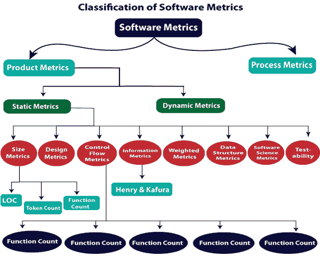

# 软件度量

> 原文：<https://www.javatpoint.com/software-engineering-software-metrics>

软件度量是对可测量或可计数的软件特性的度量。软件度量是有价值的，原因有很多，包括衡量软件性能、规划工作项目、衡量生产力以及许多其他用途。

在软件开发过程中，许多指标都是相互关联的。软件度量类似于管理的四个功能:计划、组织、控制或改进。

## 软件度量的分类

**软件度量可以分为以下两种类型:**

**1。产品度量:**这些是软件产品各种特性的度量。两个重要的软件特征是:

1.  软件的规模和复杂性。
2.  软件的质量和可靠性。

这些指标可以针对 SDLC 的不同阶段进行计算。

**2。过程度量:**这些是软件开发过程的各种特征的度量。比如故障检测的效率。它们被用来衡量用于开发软件的方法、技术和工具的特征。

## 度量的类型

**内部度量:**内部度量是用于测量被认为对软件开发人员更重要的属性的度量。例如，代码行度量。

**外部度量:**外部度量是用于测量被认为对用户更重要的属性的度量，例如可移植性、可靠性、功能性、可用性等。

**混合度量:**混合度量是将产品、流程和资源度量结合在一起的度量。例如，每个功能点的成本，其中功能点代表功能点指标。

**项目度量:**项目度量是项目经理用来检查项目进度的度量。来自过去项目的数据被用来收集各种指标，比如时间和成本；这些估计被用作新软件的基础。请注意，随着项目的进行，项目经理将不时检查其进度，并将努力、成本和时间与原始努力、成本和时间进行比较。还要明白，这些指标用于降低开发成本、时间和风险。项目质量也可以提高。随着质量的提高，错误和时间的数量以及所需的成本也减少了。

## 软件度量的优势

软件系统各种设计方法的比较研究。

对不同编程语言的特性进行分析、比较和批判性研究。

比较和评估软件开发人员的能力和生产力。

在编制软件质量规范时。

验证软件系统要求和规范的符合性。

推断在软件系统的设计和开发中投入的努力。

了解代码的复杂性。

在决定是否进一步划分复杂模块时。

指导资源经理正确使用资源。

在软件开发和维护成本之间进行比较和设计权衡。

在软件开发生命周期的各个阶段向软件经理提供关于进度和质量的反馈。

为测试代码分配测试资源。

## 软件度量的缺点

软件度量的应用并不总是容易的，在某些情况下，它是困难和昂贵的。

软件度量的验证和证明是基于历史/经验数据，这些数据的有效性很难验证。

这些对于管理软件产品是有用的，但是对于评估技术人员的表现是没有用的。

软件度量的定义和推导通常基于假设，这些假设不是标准化的，可能取决于可用的工具和工作环境。

大多数预测模型依赖于对某些变量的估计，而这些变量通常并不精确。

* * *