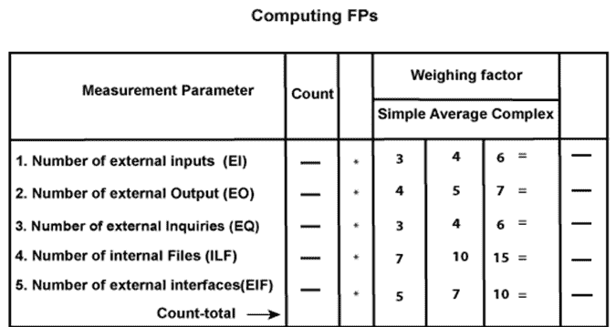

# 功能点分析

> 原文：<https://www.javatpoint.com/software-engineering-functional-point-fp-analysis>

艾伦·阿尔布雷特最初于 1979 年在国际商用机器公司开发了功能点分析，并由国际功能点用户组进一步修改。FPA 用于评估软件项目，包括根据软件产品的功能或功能大小进行测试。然而，功能点分析可用于产品的测试评估。产品的功能大小是用功能点来衡量的，功能点是衡量软件应用的衡量标准。

## 计划生育协会的目标

功能点分析的基本和主要目的是测量软件应用程序的功能大小，并根据客户、客户和利益相关者的要求提供给他们。此外，它被用来衡量软件项目的开发和维护，在整个项目中始终如一，与工具和技术无关。

**以下是关于 FPs 的几点**

1.应用程序的 FPs 是通过计算应用程序中使用的函数的数量和类型来找到的。应用程序中使用的各种功能可以分为五种类型，如表所示:

**FP 属性的类型**

| 测量参数 | 例子 |
| 1.外部输入数量 | 输入屏幕和表格 |
| 2.外部输出数量 | 输出屏幕和报告 |
| 3.外部查询数量(EQ) | 提示和中断。 |
| 4.内部文件数量(ILF) | 数据库和目录 |
| 5.外部接口数量(EIF) | 共享数据库和共享例程。 |

然后单独评估所有这些参数的复杂性。

**FPA 功能单元如图:**

2.FP 表征了软件系统的复杂性，因此可以用来描述项目时间和人力需求。

3.开发项目所需的努力取决于软件的功能。

4.FP 是独立于编程语言的。

5.FP 方法用于数据处理系统，像信息系统这样的业务系统。

6.上面提到的五个参数也被称为信息域特征。

7.上面提到的所有参数都被分配了一些由实验确定的权重，如表所示

**5-FP 属性的权重**

| 测量参数 | 低的 | 平均的 | 高的 |
| 1.外部输入数量 | seven | Ten | Fifteen |
| 2.外部产出数量 | five | seven | Ten |
| 3.外部查询数量(EQ) | three | four | six |
| 4.内部文件数量(ILF) | four | five | seven |
| 5.外部接口数量(EIF) | three | four | six |

功能的复杂性与每个功能的相应权重相乘，并将这些值相加，以确定子系统的 UFP(未调整的功能点)。

这里，对于一个测量参数类型，加权因子可以是简单的、平均的或复杂的。

因此，功能点(FP)通过以下公式计算。

**FP = Count-total *【0.65+0.01 *∑(fI)】**
**= Count-total * CAF**

其中计数-总数从上表中获得。

**caf =【0.65+0.01 * *(fI]**

**∑(f i )** 为全部 14 份问卷的总和，显示复杂度调整值/因子-CAF(其中 I 的范围为 1-14)。通常情况下，会给学生提供∑(f i 的值)

还要注意的是 **∑(f i )** 的范围是从 0 到 70，即，

0 <= ∑(f i ) < =70

并且 CAF 的范围从 0.65 到 1.35，因为

1.  当 **∑(f i )** = 0 时，则 CAF = 0.65
2.  当 **∑(f i )** = 70 时，则 CAF = 0.65+(0.01 * 70)= 0.65+0.7 = 1.35

基于软件的 FP 度量，可以计算许多其他度量:

1.  错误/计划
2.  $/FP。
3.  缺陷/计划生育
4.  文件页数/平面图
5.  错误/预防性维护。
6.  生产率=生产计划/项目管理(工作量以人月为单位)。
7.  $/文档页。

8.应用程序的位置可以从 FPs 中估计。也就是说，它们是可相互转换的。**这个过程被称为逆火**。例如，1 FP 大约等于 100 行 COBOL 代码。

9.计划生育指标主要用于衡量管理信息系统软件的规模。

10.但上面得到的函数点是未调整的函数点(UFPs)。通过考虑一些更一般的系统特性(GSCs)，子系统的这些(ufp)被进一步调整。这是一组需要考虑的 14 个全球供应链。调节 ufp 的程序如下:

1.  这 14 个全球供应链中的每一个的影响程度以 0 到 5 的等级进行评估。(b)如果一个特定的 GSC 没有影响力，那么它的权重取为 0，如果它有强大的影响力，那么它的权重为 5。
2.  将所有 14 个全球供应链的得分相加，以确定总影响度。
3.  然后使用公式从 TDI 计算值调整系数(VAF):**VAF =(TDI * 0.01)+0.65**

请记住，VAF 值在 0.65 到 1.35 之间，因为

1.  当 TDI = 0 时，VAF = 0.65
2.  当 TDI = 70 时，VAF = 1.35
3.  然后，VAF 与 UFP 相乘，得到最终的 FP 计数: **FP = VAF * UFP**

**示例:**计算以下数据的功能点、生产率、文档、每个功能的成本:

1.  用户输入数量= 24
2.  用户输出数量= 46
3.  查询数量= 8
4.  文件数量= 4
5.  外部接口数量= 2
6.  努力=下午 36.9
7.  技术文件= 265 页
8.  用户文档= 122 页
9.  成本= 7744 美元/月

各种处理复杂度因素有:4、1、0、3、3、5、4、4、3、3、2、2、4、5。

**解决方案:**

| 测量参数 | 数数 |  | 加权因子 |
| 1.外部输入数量 | Twenty-four | * | 4 = 96 |
| 2.外部产出数量 | Forty-six | * | 4 = 184 |
| 3.外部查询数量(EQ) | eight | * | 6 = 48 |
| 4.内部文件数量(ILF) | four | * | 10 = 40 |
| 5.外部接口数量(EIF)计数-总数→ | Two | * | 5 = 10
378 |

所以所有 f i (i ← 1 到 14)= 4+1+0+3+5+4+4+3+2+2+4+5 = 43

FP = Count-total *[0.65+0.01 *∑(fI)]
= 378 *[0.65+0.01 * 43]
= 378 *[0.65+0.43]
= 378 * 1.08 = 408

文件总页数=技术文件+用户文件
= 265+122 = 387 页

文件=文件页数/FP
= 387/408 = 0.94

## 区分 FP 和 LOC

| 冰点 | 通信线路（LinesofCommunication） |
| 1.FP 是基于规范的。 | 1.LOC 是基于类比的。 |
| 2.FP 是独立于语言的。 | 2.LOC 依赖于语言。 |
| 3.FP 是面向用户的。 | 3.LOC 是面向设计的。 |
| 4.它可以扩展到 LOC。 | 4.可转换为 FP(逆火) |

* * *