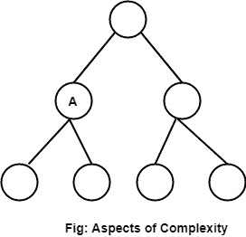

# 信息流度量

> 原文：<https://www.javatpoint.com/software-engineering-information-flow-metrics>

我们将考虑的另一组指标称为信息流指标。信息流度量的基础是基于以下概念:最简单的系统由组件组成，正是这些组件所做的工作以及它们是如何装配在一起的，确定了系统的复杂性。以下是信息流中使用的工作定义:

**组件:**通过将(软件)系统分解成其组成部分而识别的任何元素。

**内聚力:**组件执行单一功能的程度。

**耦合:**该术语用于描述同一系统中一个组件与其他组件之间的链接程度。

信息流度量通过观察系统组件或模块之间的信息流来处理这种类型的复杂性。这个指标由**亨利和**卡富拉给出。所以它也被称为亨利和卡富拉的度量。

该指标基于系统模块间信息流的测量。它对由于系统组件之间的互连而导致的复杂性很敏感。这个度量包括软件模块的复杂性，被定义为模块中包含的过程的复杂性的总和。由于以下两个因素，流程会增加复杂性。

1.  过程代码本身的复杂性。
2.  由于过程与其环境的联系而导致的复杂性。第一个因素的影响已经包括在代码行测量中。对于第二个因素的量化，亨利和卡富拉定义了两个术语，即扇入和扇出。

**扇入:**过程的扇入是进入该过程的本地流的数量加上该过程从中检索信息的数据结构的数量。

**扇出:**扇出是来自该过程的本地流的数量加上该过程更新的数据结构的数量。

程序复杂性=长度*(扇入*扇出)*2

* * *