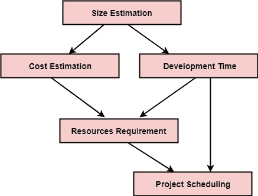

# 软件项目规划

> 原文：<https://www.javatpoint.com/software-project-planning>

软件项目是从需求收集到测试和支持的完整的编程方法，由执行过程在指定的时间内完成，以实现预期的软件产品。

## 软件项目管理的需求

软件开发是世界商业中的一个新领域，几乎不涉及结构化编程项目。大多数编程项目都是定制的，以满足客户的需求。最重要的是，底层技术变化和进步如此普遍和迅速，以至于一个元素的体验可能与另一个元素没有联系。所有这些业务和生态的需要都会给软件开发带来风险；因此，有效地管理软件项目是至关重要的。

## 软件项目经理

软件经理负责计划和安排项目开发。他们管理这项工作，以确保它按照要求的标准完成。他们监控进度，以检查活动是否按时并在预算范围内。项目规划必须包括主要问题，如规模和成本估算计划、项目监控、人员选择评估和风险管理。要计划一个成功的软件项目，我们必须了解:

*   待完成的工作范围
*   风险分析
*   强制性资源
*   要完成的项目
*   被跟踪记录

软件项目规划在技术工作开始之前就开始了。规划活动的各个步骤是:

规模是估计其他活动的关键参数。根据成本和开发时间，需要资源需求。项目进度对于控制和监控项目进度可能非常有用。这取决于资源和开发时间。

* * *