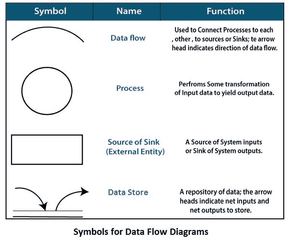
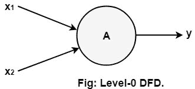
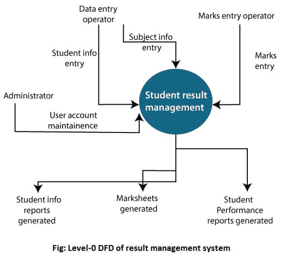
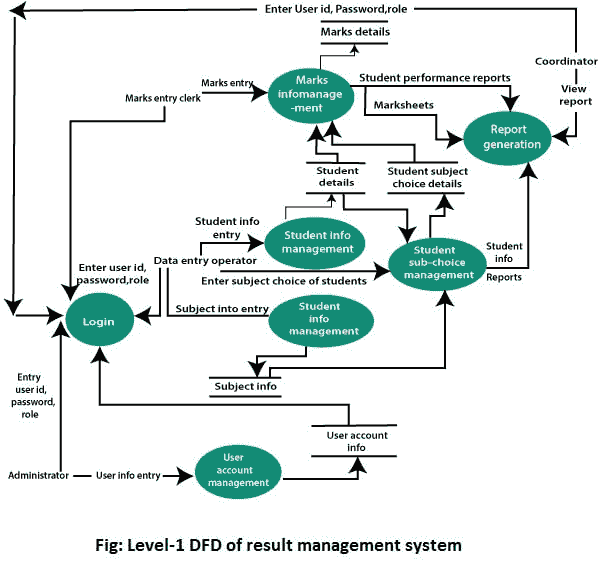
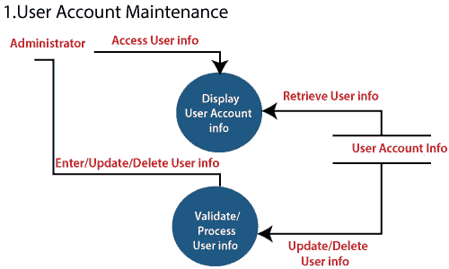
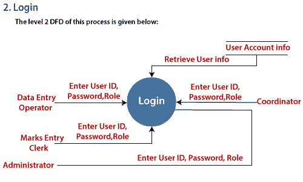
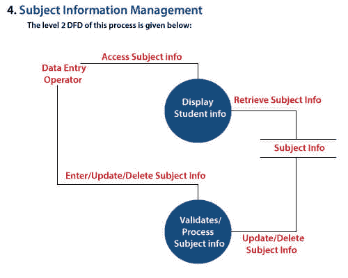
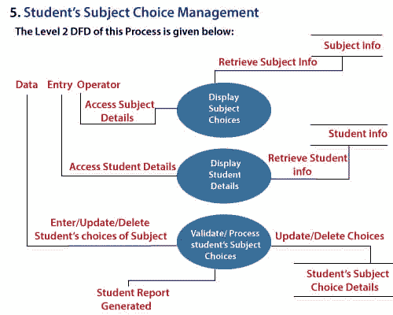

# 数据流图

> 原文：<https://www.javatpoint.com/software-engineering-data-flow-diagrams>

数据流图(DFD)是系统内信息流的传统视觉表示。一个简洁明了的 DFD 可以形象地描述系统需求的正确数量。它可以是手动的、自动的或两者的结合。

它显示了数据如何进入和离开系统，什么改变了信息，以及数据存储在哪里。

DFD 的目标是展示整个系统的范围和边界。它可以用作系统分析师和任何在重新设计系统的起点中扮演角色的人之间的沟通工具。DFD 也被称为数据流图或气泡图。

**以下关于 DFD 的观察是必不可少的:**

1.  所有名称都应该是唯一的。这使得提及 DFD 的元素变得更加容易。
2.  记住，DFD 不是一个流程图。箭头是表示事件顺序的流程图；DFD 的箭头代表流动的数据。DFD 不涉及任何事件顺序。
3.  压制逻辑决策。如果我们有在 DFD 画一个菱形框的冲动，抑制住这种冲动！流程图中使用菱形框来表示存在多条路径的决策点，其中只有一条路径被采用。这意味着事件的顺序，这在 DFD 是没有意义的。
4.  不要被细节所困扰。将错误条件和错误处理推迟到分析结束。

DFD 的标准符号来自电路图分析，如图所示:

**圆圈:**圆圈(气泡)表示将数据输入转换为数据输出的过程。

**数据流:**曲线表示数据流入或流出进程或数据存储。

**数据存储:**一组平行线表示数据项集合的地方。数据存储表示存储的数据可以在稍后阶段使用，或者由其他进程以不同的顺序使用。数据存储可以有一个元素或一组元素。

**源或汇:**源或汇是一个外部实体，充当系统输入的源或系统输出的汇。

## 数据流图中的级别(DFD)

DFD 可用于执行任何抽象级别的系统或软件。事实上，DFD 可以划分为代表不断增加的信息流和功能细节的层次。DFD 的等级编号为 0、1、2 或更高。在这里，我们将主要看到数据流图中的三个级别，它们是:0 级 DFD、1 级 DFD 和 2 级 DFD。

**0 级 DFDM**

它也被称为基本系统模型，或者上下文图将整个软件需求表示为单个气泡，输入和输出数据由输入和输出箭头表示。然后系统被分解并描述为一个有多个气泡的 DFD。然后，由这些气泡中的每一个表示的系统部分被分解并记录为越来越详细的 DFD。这个过程可以根据需要在尽可能多的层次上重复，直到手头的程序被很好地理解。在不同级别之间保持输入和输出的数量是至关重要的，这个概念被 DeMacro 称为水平调整。因此，如果气泡“A”有两个输入 x 1 和 x 2 和一个输出 y，那么表示“A”的扩展 DFD 应该正好有两个外部输入和一个外部输出，如图所示:

结果管理系统的 Level-0 DFD，也称为上下文图，如图所示，随着气泡被分解成越来越少的抽象气泡，相应的数据流也可能需要被分解。

**1 级 DFD**

在一级 DFD 中，一个上下文图被分解成多个气泡/过程。在这一层，我们强调系统的主要目标，并将 0 级 DFD 的高级过程分解为子过程。

**2 级 DFD**

二级 DFD 深入到一级 DFD 的部分地区。它可用于投射或记录系统功能的具体/必要细节。

* * *