# 实体关系图

> 原文：<https://www.javatpoint.com/software-engineering-entity-relationship-diagrams>

ER 建模是软件工程中用于产生信息系统概念数据模型的数据建模方法。使用这种 ER 建模方法创建的图称为实体关系图或 ER 图或实体关系图。

## ERD 的目的

*   通过构建 ERD 的步骤，数据库分析师可以更好地理解数据库中包含的数据。
*   ERD 是一个文件工具。
*   最后，ERD 用于将数据库的逻辑结构连接到用户。特别是，ERD 有效地向用户传达了数据库的逻辑。

## 电流变图的组成部分

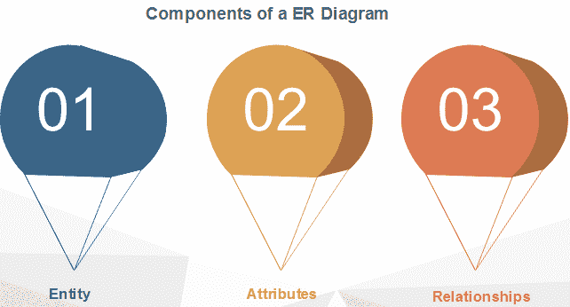

### 1.实体

一个实体可以是一个真实世界的物体，可以是有生命的，也可以是无生命的，仅仅是可以识别的。实体在 ER 图中表示为矩形。例如，在学校数据库中，学生、教师、班级和提供的课程可以被视为实体。所有这些实体都有一些赋予它们身份的属性。

**实体集**

实体集是相关类型实体的集合。实体集可以包括具有共享相似值的属性的实体。例如，学生集合可能包含一所学校的所有学生；同样，教师集合可以包括学校所有院系的所有教师。实体集不必是不相交的。

### 2.属性

实体是利用它们的属性来表示的，称为属性。所有属性都有值。例如，学生实体可以有姓名、班级和年龄作为属性。

存在可以分配给属性的值域或值域。例如，学生的姓名不能是数值。它必须是字母。学生的年龄不能是负数等。

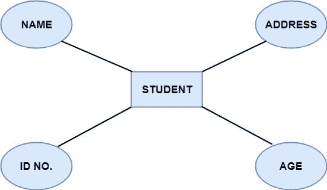

**有四种属性:**

1.  信息标号属性
2.  复合属性
3.  单值属性
4.  多值属性
5.  派生属性

**1。键属性:**键是在实体集中唯一标识一个实体的属性或属性集合。例如，学生的学号使他在学生中是可识别的。

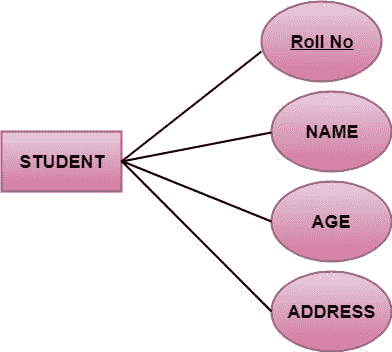

**主要有三种按键:**

1.  **超级键:**在实体集里共同标识一个实体的一组属性。
2.  **候选密钥:**最小超级密钥被称为候选密钥。一个实体集可能有多个候选键。
3.  **主键:**主键是数据库设计者为唯一标识实体集而选择的候选键之一。

**2。复合属性:**由其他属性组合而成的属性称为复合属性。例如，在学生实体中，学生地址是一个复合属性，因为地址由 pin 码、州、国家等其他特征组成。

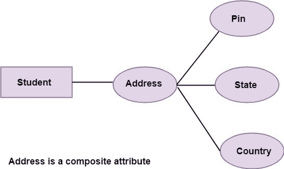

**3。单值属性:**单值属性包含单个值。例如，社会安全号。

**4。多值属性:**如果一个属性可以有多个值，则称为多值属性。多值属性由双椭圆描述。例如，一个人可以有多个电话号码、电子邮件地址等。

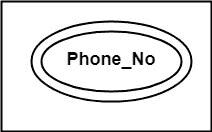

**5。派生属性:**派生属性是物理数据库中不存在的属性，但其值是从数据库中存在的其他属性派生而来的。例如，年龄可以从出生日期导出。在 ER 图中，派生属性由虚线椭圆表示。

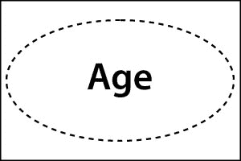
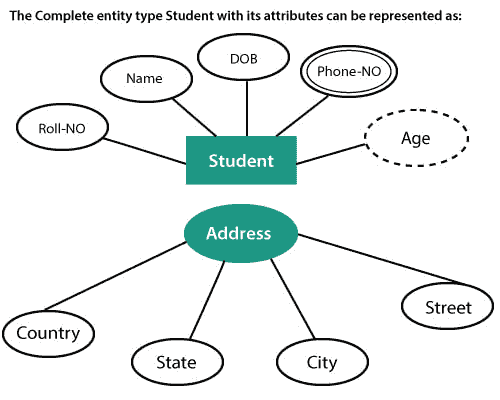

## 3.关系

实体之间的关联称为关系。关系由菱形框表示。例如，员工在部门工作，学生注册课程。在这里，工作和注册被称为关系。

## 关系集

一组相似类型的关系称为关系集。像实体一样，关系也可以有属性。这些属性称为描述性属性。

## 关系集的度

关系中参与实体的数量描述了关系的程度。E-R 模型中最常见的三种关系是:

1.  一元(度 1)
2.  二进制(度 2)
3.  三元(度 3)

**1。一元关系:**这也叫递归关系。它是一个实体类型的实例之间的关系。比如一个人只和一个人结婚。

**2。二元关系:**是两个实体类型的实例之间的关系。例如，老师教这个科目。

**3。三元关系:**是三种实体类型的实例之间的关系。在图中，关系“**可能具有**，提供三个实体的关联，即，教师、学生和主题。这三个实体都是多对多的参与者。三元关系中可能有一个或多个参与者。

一般来说， **n** 个实体可以通过相同的关系联系起来，称为 **n 元**关系。

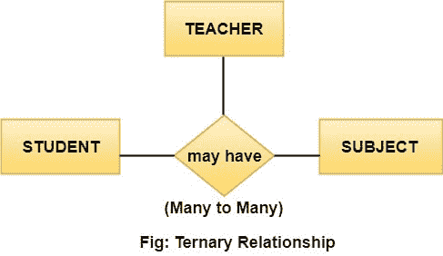

## 基数

基数描述一个实体集的实体数量，可以通过关系集与其他集的实体数量关联。

### 基数的类型

**1。一对一:**实体集 A 的一个实体最多可以包含实体集 B 的一个实体，反之亦然。假设每个学生只有一个学生证，每个学生证只分配给一个人。所以，关系会是一对一的。

**使用集合，可以表示为:**

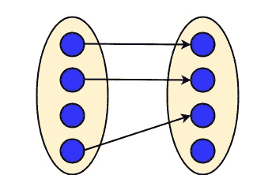

**2。一对多:**当一个实体的单个实例与另一个实体的多个实例相关联时，它被称为一对多关系。例如，一个客户可以下很多订单；一个订单不能被很多客户下单。

**使用集合，可以表示为:**

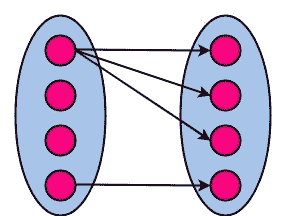

**3。多对一:**实体集 A 的多个实体最多可以与实体集 B 的一个实体关联，但是实体集 B 的一个实体可以与实体集 A 的多个实体关联，例如——很多学生可以在一个学院学习，但是一个学生不能同时在多个学院学习。

**使用集合，可以表示为:**

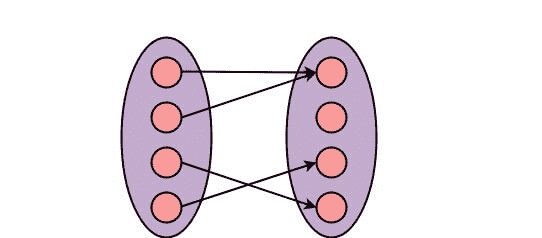

**4。多对多:**A 中的一个实体可以与 B 中的多个实体相关联，反之亦然。例如，学生可以被分配到多个项目，一个项目可以被分配到多个学生。

**使用集合，可以表示为:**

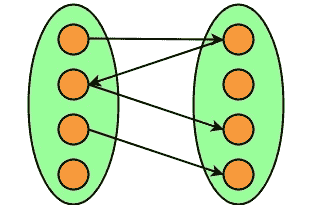

* * *