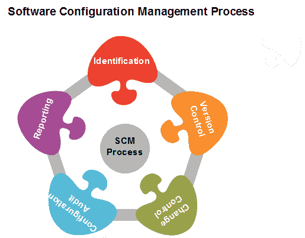

# 供应链管理流程

> 原文：<https://www.javatpoint.com/scm-process>

它使用工具来确保必要的变更已经被适当地实施到适当的组件。供应链管理过程定义了许多任务:

*   软件配置中对象的标识
*   版本控制
*   变更控制
*   配置审计
*   状态报告

**识别**

**基本对象:**软件工程师在分析、设计、编码或测试过程中创建的文本单元。

**聚合对象:**基本对象和其他聚合对象的集合。设计规范是一个集合对象。

每个对象都有一组独特的特征来唯一地标识它:名称、描述、资源列表和“实现”

**配置对象之间的相互关系可以用模块互连语言(MIL)来描述。**

**版本控制**

版本控制结合了过程和工具来处理软件过程中生成的不同版本的配置对象。

**Clemm 在 SCM 的上下文中定义版本控制:**配置管理允许用户通过选择合适的版本来指定软件系统的替代配置。通过将属性与每个软件版本相关联，然后允许通过描述所需的属性集来指定[和构建]配置，来支持这一点。

**变更控制**

詹姆斯·巴赫在供应链管理的背景下描述变更控制是:变更控制是至关重要的。但是使它成为必要的力量也使它令人讨厌。

我们担心变更，因为代码中的一个小混乱会导致产品的大失败。但它也可以修复一个重大故障，或实现令人难以置信的新功能。

我们担心改变，因为一个流氓开发人员可能会使项目失败，然而优秀的想法来自这些流氓的头脑

繁琐的变更控制过程会有效地阻止他们进行创造性的工作。

提交并计算变更请求，以评估技术价值；潜在的副作用，对其他配置对象和系统功能的总体影响，以及变更的预计成本。

评估结果以变更报告的形式呈现，变更控制机构(CCA)使用该报告，CCA 是对变更的状态和优先级做出最终决定的个人或团体。

“签入”和“签出”过程实现了变更控制的两个必要元素- **访问控制**和**同步控制**。

**访问控制**控制哪些软件工程师有权访问和修改特定的配置对象。

**同步控制**有助于确保由两个不同的人执行的并行更改不会相互覆盖。

**配置审核**

SCM 审核以验证软件产品满足基线要求，并确保构建的内容和交付的内容。

SCM 审核还确保在所有配置项之间保持可追溯性，并且所有工作请求都与一个或多个配置项修改相关联。

供应链管理审计是“T0”监督者“T1”，确保项目范围的完整性得到维护。

**状态报告**

配置状态报告(有时也称为状态核算)通过管理指南、用户指南、常见问题解答、发行说明、安装指南、配置指南等向开发人员、测试人员、最终用户、客户和利益相关者提供准确的状态和当前配置数据。

* * *