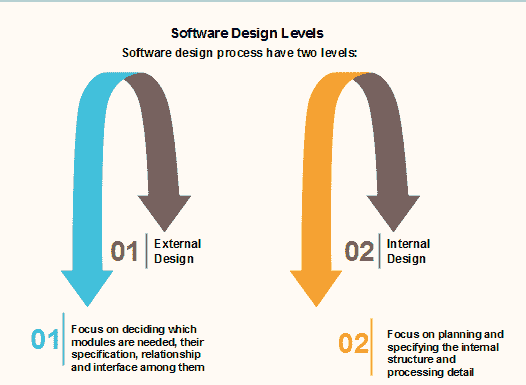
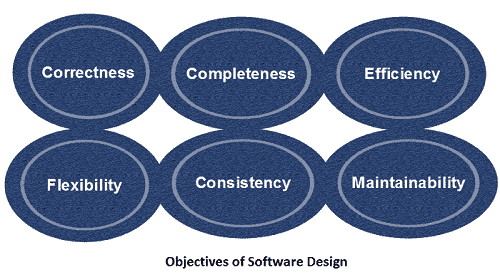

# 软件设计

> 原文：<https://www.javatpoint.com/software-engineering-software-design>

软件设计是将用户需求转换成某种合适形式的机制，有助于程序员进行软件编码和实现。它处理将客户的需求表示成一种形式，即使用编程语言容易实现的形式，如软件需求规范(SRS)文档中所描述的。

软件设计阶段是 **SDLC(软件设计生命周期)**的第一步，将关注点从问题域转移到解决方案域。在软件设计中，我们认为系统是一组具有明确定义的行为&边界的组件或模块。

## 软件设计的目标

以下是软件设计的目的:

1.  **正确性:**软件设计应按要求正确。
2.  **完整性:**设计应该具备数据结构、模块、外部接口等所有组件。
3.  **效率:**程序要高效利用资源。
4.  **灵活性:**能够根据不断变化的需求进行修改。
5.  **一致性:**设计中不应有任何不一致。
6.  **可维护性:**设计要简单到其他设计师也能轻松维护。

* * *