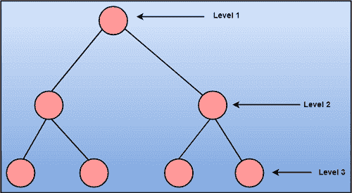
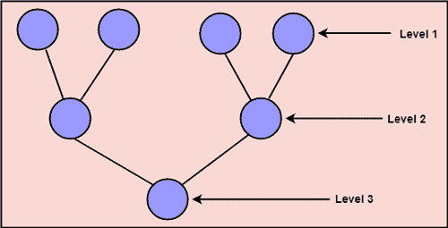

# 软件设计原则

> 原文：<https://www.javatpoint.com/software-engineering-software-design-principles>

软件设计原则涉及提供有效处理设计过程复杂性的方法。有效管理复杂性不仅可以减少设计所需的工作量，还可以减少设计过程中引入错误的范围。

## 以下是软件设计的原则

## 问题划分

对于小问题，我们可以一次处理整个问题，但是对于大问题，划分问题并征服问题，这意味着将问题划分成更小的部分，以便每个部分都可以单独捕获。

对于软件设计，目标是将问题分成可管理的部分。

### 问题划分的好处

1.  软件很容易理解
2.  软件变得简单
3.  软件易于测试
4.  软件很容易修改
5.  软件易于维护
6.  软件易于扩展

这些部分不能完全相互独立，因为它们共同构成了系统。他们必须合作和沟通来解决问题。这种交流增加了复杂性。

#### 注意:随着分区数量的增加=分区成本和复杂度的增加

* * *

## 抽象

抽象是一种工具，它使设计者能够在抽象层次上考虑组件，而不必担心实现的内部细节。抽象可以用于现有的元素以及正在设计的组件。

这里有两种常见的抽象机制

1.  功能抽象
2.  数据抽象

### 功能抽象

1.  模块由其执行的方法指定。
2.  实现这些功能的算法的细节对于该功能的用户是不可见的。

功能抽象形成了**面向功能的设计方法**的基础。

### 数据抽象

数据用户看不到数据元素的细节。数据抽象形成了面向对象设计方法的基础。

* * *

## 模块性

模块化是指将软件划分为不同的模块，这些模块的名称和地址不同，并在以后进行集成，以获得功能完整的软件。这是允许程序在智力上可管理的唯一属性。单个大型程序由于存在大量的引用变量、控制路径、全局变量等，很难理解和阅读。

**模块化系统的理想特性是:**

*   每个模块都是一个定义明确的系统，可以与其他应用程序一起使用。
*   每个模块都有单独的特定目标。
*   模块可以单独编译并保存在库中。
*   模块应该更容易使用而不是构建。
*   模块从外部比内部简单。

### 模块化的优缺点

在本主题中，我们将讨论模块化的各种优缺点。

**模块化的优势**

模块化有几个优点

*   它允许几个或不同的人编写大型程序
*   它鼓励创建放在库中并由其他程序使用的常用例程。
*   它简化了将大型程序加载到主存储器的覆盖过程。
*   它提供了更多的检查点来衡量进展。
*   它为完整的测试提供了一个框架，更易于测试
*   它产生了设计良好、可读性更强的程序。

**模块化的缺点**

模块化有几个缺点

*   执行时间可能，但不一定，更长
*   存储大小可能会增加，但并不确定
*   编译和加载时间可能会更长
*   模块间的通信问题可能会增加
*   需要更多的链接，运行时间可能会更长，必须编写更多的源代码行，并且必须完成更多的文档

### 标准设计

模块化设计通过允许并行开发系统的各个部分，降低了设计的复杂性，并使实现更加容易和快速。我们将在本节中详细讨论模块化设计的不同部分:

**1。功能独立:**功能独立是通过开发只执行一种任务，不与其他模块过度交互的功能来实现的。独立性很重要，因为它使实现更容易和更快。独立模块更容易维护、测试和减少错误传播，也可以在其他程序中重用。因此，功能独立性是保证软件质量的一个很好的设计特征。

**使用两个标准测量:**

*   **内聚性:**衡量一个模块的相对功能强度。
*   **耦合:**衡量模块之间的相对依赖关系。

**2。信息隐藏:**信息隐藏的基本原理是，模块可以通过保护免受其他模块影响的设计决策来表征，换句话说，模块应该被指定为包含在模块中的数据对于不需要这些信息的其他模块是不可访问的。

当在测试期间和随后的软件维护期间需要修改时，使用信息隐藏作为模块化系统的设计标准提供了最显著的好处。这是因为大多数数据和过程对软件的其他部分是隐藏的，在修改过程中引入的无意错误不太可能传播到软件中的不同位置。

* * *

## 设计策略

一个好的系统设计策略是用一种易于开发和修改的方法来组织程序模块。结构化设计方法帮助开发人员处理程序的规模和复杂性。分析师为开发人员生成关于代码应该如何组成以及代码片段应该如何组合在一起形成一个程序的指令。

要设计系统，有两种可能的方法:

1.  自上而下的方法
2.  自下而上的方法

**1。自上而下的方法:**这种方法从识别主要组件开始，然后将它们分解成更详细的子组件。

**2。自下而上的方法:**自下而上的方法从较低的细节开始，并向层次结构的上方移动，如图所示。这种方法适用于现有系统的情况。

* * *