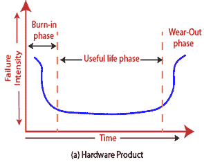
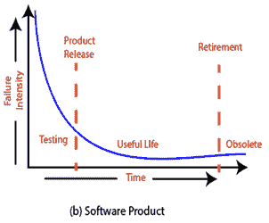
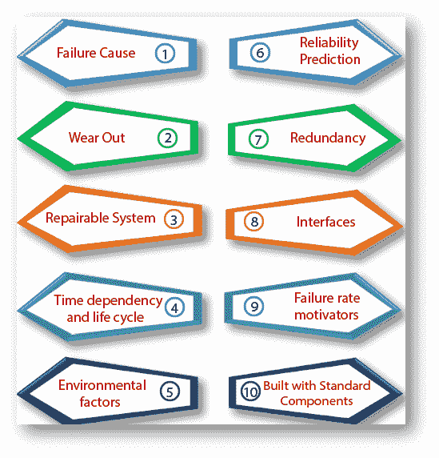

# 软件故障机制

> 原文：<https://www.javatpoint.com/software-engineering-software-failure-mechanisms>

软件故障可分为:

**瞬时故障:**这些故障仅在特定输入下发生。

**永久性故障:**该故障出现在所有输入上。

**可恢复故障:**系统无需操作员帮助即可恢复。

**不可恢复故障:**系统只能在操作员帮助下恢复。

**非损坏故障:**故障不会损坏系统状态或数据。

**损坏故障:**损坏系统状态或数据。

软件故障可能是由于软件应该满足的规范的错误、模糊、疏忽或误解、编写代码时的粗心或无能、测试不充分、软件使用不正确或意外或其他不可预见的问题造成的。

## 硬件与软件的可靠性

| 硬件可靠性 | 软件可靠性 |
| 硬件故障大多是物理故障。 | 软件故障是设计故障，很难可视化、分类、检测和纠正。 |
| 硬件组件通常因磨损而失效。 | 软件组件由于错误而失败。 |
| 在硬件方面，设计故障也可能存在，但物理故障一般占主导地位。 | 在软件上，我们可以简单的为**制造**找到一个严格对应的对应作为硬件制造过程，如果把软件模块上传到位的简单动作不算。因此，一旦软件上传到存储器并开始运行，其质量就不会改变 |
| 硬件呈现如下图所示的故障特征:

被称为**浴缸曲线**。期间 A、B 和 C 分别代表老化阶段、使用寿命阶段和寿命结束阶段。 | 软件可靠性不显示与硬件相似的相同特征。下图中显示了一条可能的曲线:

如果我们将软件可靠性投影在相同的轴上。 |

**硬件和软件曲线有两个显著差异的是:**

一个不同之处是，在最后一个阶段，软件不像硬件那样有**不断增加的故障率**。在这个阶段，软件正在接近**淘汰**；没有对软件进行任何升级或更改的动机。因此，故障率不会改变。

第二个区别是在**使用寿命**阶段，软件每次升级都会经历故障率的急剧增加。故障率逐渐趋于平稳，部分原因是更新后产生和修复的缺陷。

上图中的升级表示**功能升级**，而不是可靠性升级。对于功能升级，软件的复杂性可能会增加，因为软件的功能得到了增强。如果错误修复在软件中引入了其他缺陷，甚至错误修复也可能是更多软件失败的原因。对于**可靠性升级**，如果升级的目标是提高软件可靠性，如使用更好的工程方法(如洁净室方法)重新设计或重新实施某些模块，则很可能导致软件故障率下降。

**下面列出了软件相对于硬件的不同特性的部分列表:**

**故障原因:**软件缺陷主要是设计缺陷。

**磨损:**软件没有能量相关的磨损阶段。bug 可能会在没有警告的情况下出现。

**可修复系统:**定期重启可以帮助修复软件查询。

**时间依赖和生命周期:**软件可靠性不是操作时间的目的。

**环境因素:**不影响软件可靠性，除了可能影响程序输入。

**可靠性预测:**软件可靠性不能从任何物理基础上预测，因为它完全依赖于设计中的人为因素。

**冗余:**如果使用相同的软件元素，则不能提高软件可靠性。

**界面:**软件界面仅仅是概念上的，而不是视觉上的。

**失败率激励因素:**从单独报表的分析中通常无法预测。

**用标准组件构建:**充分理解和广泛测试的标准元素将有助于提高可维护性和可靠性。但是在软件行业，我们没有观察到这种趋势。代码重用已经存在了一段时间，但程度很小。软件没有标准的元素，除了一些标准化的逻辑结构。

* * *