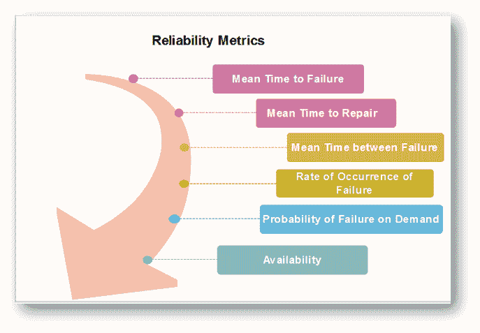
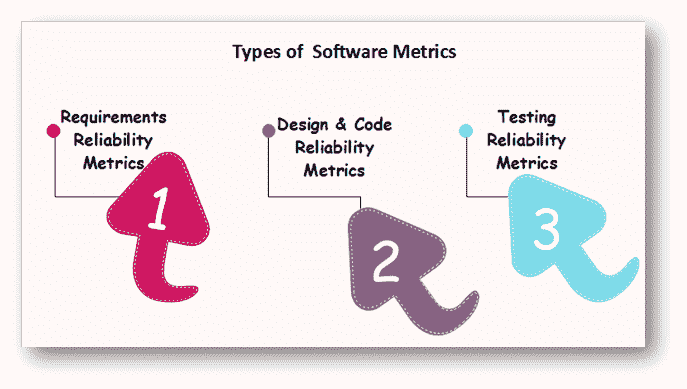

# 可靠性指标

> 原文：<https://www.javatpoint.com/software-engineering-software-reliability-metrics>

可靠性度量用于定量表示软件产品的可靠性。选择使用哪种度量取决于它所应用的系统类型&应用程序域的要求。

可用于量化软件产品可靠性的一些可靠性指标如下:

## 1.平均故障时间(MTTF)

**MTTF** 被描述为两次连续故障之间的时间间隔。一个 200 的 **MTTF** 意味着每 200 次单位可以预期一次故障。时间单位完全取决于系统&它甚至可以用交易数量来表示。 **MTTF** 对于交易量大的系统是一致的。

例如，它适用于计算机辅助设计系统，在这种系统中，设计人员将花几个小时进行设计，它也适用于文字处理系统。

为了测量 **MTTF** ，我们可以证明 n 个故障的故障数据。让故障出现在时刻 **t 1 ，t 2 .....t n** 。

**MTTF 可计算为**

## 2.平均维修时间(MTTR)

一旦出现故障，需要一些时间来修复错误。 **MTTR** 测量跟踪导致故障的错误并修复它们所需的平均时间。

## 3.平均故障间隔时间(MTBR)

我们可以合并 **MTTF** & **MTTR** 度量来获得 MTBF 度量。

**MTBF = MTTF + MTTR**

因此，300 的 **MTBF** 表示一旦出现故障，下一个故障预计仅在 300 小时后出现。在这种方法中，时间测量是实时的&而不是像在 **MTTF** 中那样的执行时间。

## 4.故障发生率

它是单位时间间隔内出现的故障数。特定操作时间内意外事件的数量。 **ROCOF** 是意外角色可能出现的频率。0.02 的 **ROCOF** 表示每 100 个运行时间单位步骤中可能发生两次故障。它也被称为故障强度指标。

## 5.按需故障概率

**POFOD** 被描述为当请求服务时系统将失败的概率。它是给定几个系统输入时系统缺陷的数量。

**POFOD** 是当发出服务请求时系统失败的可能性。

0.1 的 **POFOD** 意味着十分之一的服务请求可能会失败。 **POFOD** 是安全关键系统的基本措施。POFOD 与偶尔需要服务的保护系统相关。

## 6.可用性

可用性是系统在给定时间适用的概率。它考虑了修复时间&系统的重启时间。0.995 的可用性意味着在每 1000 个时间单位中，系统可用于其中的 **995** 。考虑到计划内和计划外停机时间，系统适用的时间百分比。如果一个系统在 100 小时的运行中平均停机 4 小时，其 **AVAIL** 为 96%。

## 可靠性的软件度量

度量用于通过识别需求领域来提高系统的可靠性。

### 不同类型的软件度量如下

### 需求可靠性度量

需求表示软件必须包括哪些功能。它指定了软件中必须包含的功能。需求必须写得让开发者和客户之间没有误解。要求必须包括有效的结构，以避免丢失有价值的数据。

需求应该是彻底的和详细的，以便设计阶段很简单。要求不应包括不充分的数据。需求可靠性度量计算所需文档的上述质量因素。

### 设计和代码可靠性指标

设计和编码计划中存在的质量方法是复杂性、规模和模块化。复杂的模块很难理解&很有可能出现错误。如果模块具有高复杂性和大尺寸或者高复杂性和小尺寸的组合，可靠性将降低。面向对象的代码也可以使用这些度量，但是在这种情况下，需要额外的度量来评估质量。

### 测试可靠性指标

这些指标使用两种方法来计算可靠性。

**首先**，规定系统配备了需求中规定的任务。正因为如此，由于缺乏功能而导致的 bug 减少了。

第二种**方法是计算代码，找到 bug&修复它们。为了确保系统包含指定的功能，编写了包含多个测试用例的测试计划。每种测试方法都基于一个系统状态，并且测试一些基于相关需求集的任务。有效验证程序的目标是确保每个元素都经过测试，这意味着如果系统通过测试，那么需求？的功能包含在交付的系统中。**

* * *