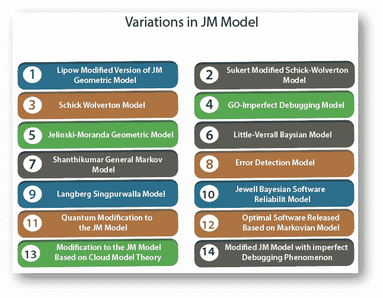

# 杰林斯基和米兰达模型

> 原文：<https://www.javatpoint.com/software-engineering-jelinski-and-moranda-model>

杰林斯基-莫兰达(JM)模型，也是一个**马尔可夫过程模型**，对后来的许多模型产生了强烈的影响，这些模型实际上是这个简单模型的修改。

## JM 模式的特点

以下是 JM 模式的特点:

1.  这是一个二项式模型
2.  它当然是最早的，当然也是最著名的黑盒模型之一。
3.  J-M 模型总是产生过于乐观的可靠性预测。
4.  JM 模型遵循一个完美的调试步骤，即检测到的故障被确定地移除简单模型。
5.  J 的恒定软件故障率？i^th 失效区间的 m 模型由下式给出:

**λ(t i ) = ϕ [N-(i-1)]，i=1，2...普通.........等式 1**

**其中**

**ϕ**=一个比例常数，表示每个故障的故障率

**N**=软件中的初始错误数

**tI**=从(i-1) 第次故障到(i) 第次故障之间的时间。

该模型属于二项式，其平均值和失效强度方法可通过将固有故障数分别乘以累积失效和概率密度函数(pdf)获得:

**μ(tI)= n(1-e-ϕtIT6)..............等式 2**

**和**

**(t【I】)= n-t【I】......方程 3**

这些特征加上 J-M 模型的其他四个特征总结在表中:

| 可靠性度量名称 | 可靠性公式的度量 |
| 概率密度函数 | f(tI= n-(I-1)e-【n-(I-1)]tI |
| 软件可靠性功能 | r(t)= e【n-(I-1)】t【I】 |
| 故障率函数 | λ(tI= n-(I-1)] |
| 平均失效时间函数 |  |
| 平均值函数 | (tI= n(1-e-I |
| 故障强度函数 | euro(tI= n—tI |
| 中位数 | m={ϕ[n-(i-1)]}-12 |
| 累积分布函数 | f(tI= 1-e【n-(I-1)]tI |

## 假设

J-M 模型中的假设包含以下内容:

1.  初始软件错误的数量未知，但固定不变。
2.  软件中的每个错误都是独立的，在测试过程中同样可能导致失败。
3.  故障发生之间的时间间隔是独立的、指数分布的随机变量。
4.  软件故障率在故障发生的范围内保持固定。
5.  故障率对应于软件中剩余的故障数量。
6.  检测到的错误被立即移除，并且在移除检测到的缺陷期间不会引入新的错误。
7.  每当出现故障时，相应的故障肯定会减少。

## JM 模式的变化

JM 模型是第一个突出的软件可靠性模型。几位研究人员对此模型表示出兴趣并进行修改，使用了不同的参数，如故障率、完美调试、不完美调试、故障数量等。现在，我们将讨论这个模型的不同现有变体。

### 1.Jelinski-morada 几何模型的 Lipow 修改版

它允许在一个时间间隔内清除多个 bug。程序失败率变为

**(t【I】)= dk【n】【I-1】**

其中 **n i-1** 是在第(i-1)个时间间隔内发现的累计错误数。

### 2.苏克特修正的希克-沃尔弗顿模型

Sukert 修改了 **S-W 模型**，以允许在每个时间间隔出现多个故障。程序失败率变为

其中 **n i-1** 是第(i-1)个故障间隔的累计故障数。

### 3.谢克·沃尔弗顿模型

Schick 和 Wolverton **(S-W)模型**与 **J-M 模型**相似，只是它进一步考虑了自上次调试以来，第 I 个时间间隔的故障率随时间增加。

**假设**

*   错误是偶然发生的。
*   定义的时间间隔内的错误检测率是恒定的。
*   错误是相互独立的。
*   没有开发新的 bug。
*   bug 在被检测到后会被纠正。

在该模型中，程序失败率方法是:

**(t【I】= t【n-(I-1)]t【I】**

其中 **ϕ** 为比例常数， **N** 为程序中的初始 bug 数，**tIT7】为 **(i-1)** st 失败后的测试时间。**

### 4.GO-不完美调试模型

Goel 和 Okumoto 扩展了 J-M 模型，假设每当出现故障时，错误都以概率 p 被消除。第 I 个故障间隔的程序故障率为

**(t【I】=【n-p(I-1)]**
**r(t【I】)= e【n-p(I-1)]-t**

### 5.jelinski-morada 几何模型

该模型考虑了程序失效率函数最初为常数 D，并在失效时按几何级数递减。第 I 个故障间隔的程序故障率和故障间隔时间的可靠性方法是

**(t【I】)= dk【I-1】
**r(t【I】)= e【dk】****

其中 **k** 为几何函数参数， **0 < k < 1**

### 6.利特尔-弗罗尔贝叶斯模型

该模型认为故障间隔时间是独立的指数随机变量，参数€ i=1，2....其本身具有参数**ψ(I)**和 **α** ，反映了具有先验伽马分布的编程器质量和功能难度。

其中 **B** 代表故障减少系数

### 7.尚提库马尔一般马尔可夫模型

该模型认为，故障强度作为已消除故障数量的函数如下所示

**【SG】(n，t)=ψ(t)(n【0】【n】**

其中**ψ(t)**为比例常数。

### 8.软件开发过程中应用程序的错误检测模型

这种新模型的主要特点是适应开发程序的可变(增长)大小，从而可以通过分析基本段来预测程序的质量。

**假设**

除 JM 模型假设外，该模型还有以下假设:

1.  程序中任何经过测试的初始部分都描述了整个程序的初始错误的数量和性质。
2.  当最初测试的方法被新代码增强时，错误的检测能力不受“稀释”的影响。
3.  任何时候存在的代码行数都是已知的。
4.  增长函数和缺陷检测过程是独立的。

### 9.朗伯格·辛普瓦拉模型

该模型展示了如何通过采用贝叶斯观点来综合看待用于定义计算机软件可靠性的几个模型。

该模型为使用来自冲击模型的概念的常用模型提供了不同的动机。

### 10.朱厄尔贝叶斯软件可靠性模型

朱厄尔扩展了朗伯格和辛普瓦拉(1985)的结果，并扩展了杰林斯基-莫兰达模型。

**假设**

1.  测试协议被授权运行一段固定的时间——可能，但不一定，与失败时期重合。
2.  通过考虑参数本身是具有贝塔先验分布的随机量，由单参数泊松分布推广了短缺未知数的分布。
3.  尽管参数后验分布的估计导致了复杂的表达式，我们表明未检测到的缺陷的预测分布的计算是直接的。
4.  虽然现在已经确定，可靠性增长的最大似然估计是不稳定的，但我们表明，如果需要一个点估计器，预测模型很容易计算，而无需首先获得完全分布。

### 11.JM 模型的量子修正

该模型取代了 JM 模型假设，每个错误对软件不可靠性的贡献相同，新的假设是不同类型的错误对软件故障率的影响可能不同。

**故障率:**

**其中**

**Q** =软件固有的故障量子单元的初始数量

**ψ**=单个故障量子单元对应的故障率

**wj**= ith 故障的故障量子单位的数量，即 ith 故障量子的大小

### 12.基于马尔可夫软件可靠性模型的最优软件发布

在该模型中，一种软件故障检测方法用一个带吸收的马尔可夫出生过程来解释。考虑到软件测试时间的浪费，本文修正了最优软件发布策略。

### 13.基于云模型理论的 Jelinski-Moranda 软件可靠性增长模型的改进

新的未知参数θ包含在 JM 模型参数估计中，使得**θɛ【θl，θ∩】**。置信水平是与置信区间相关的概率值(1-α)。一般来说，如果一个软件可靠性指标θ的置信区间达到，我们可以估计虚拟云 C(Ex，En，he)的数学特征，它可以通过 X 条件云生成器切换到系统定性评估。

### 14.具有不完美调试现象的修正 JM 模型

修正的 JM 模型通过放宽完整调试过程和不完整删除类型的假设，扩展了 J-M 模型:

1.  当没有引入新的故障时，故障没有被成功删除
2.  由于诊断不正确而产生新故障时，故障未成功删除。

**假设**

修改后的 J-M 模型中的假设包含以下内容:

*   初始软件错误的数量未知，但固定不变。
*   软件中的每一个错误都是独立的，在测试过程中导致失败同样可行。
*   故障发生之间的时间间隔是独立的、指数分布的随机变量。
*   软件故障率在故障发生的间隔期间保持固定。
*   故障率与软件中剩余的错误数量成正比。
*   每当发生故障时，检测到的错误以概率 p 去除，检测到的故障没有以概率 q 完全去除，新的故障以概率 r 产生，所以很明显**p+q+r = 1，q≥r**

**调试现象不完善的修正 JM 模型的各种特性列表**

| 可靠性度量名称 | 可靠性公式的度量 |
| 软件故障率 | λ(t〔t〕t0〔I〕t1 = n-(I-1)(p-r)] |
| 故障密度函数 | f(t)= n-(I-1)(p-r)]exp(-n-(I-1)(p-r)]tI |
| 分布函数 | fI(tI)= 1-exp(-n-(I-1)(p-r)]tI |
| 第 I 个故障间隔的可靠性函数 | r(tI)= 1-fI(tI)= exp(-n-(I-1)(p-r)]tI |
| 平均失效时间函数 | 1/n-(I-1)(p-r)) |

* * *